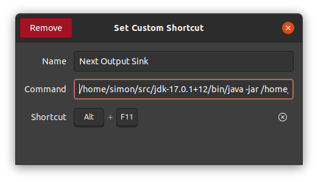

Switches your audio output programmatically.

# Requirements

PulseAudio (POSIX systems)

pacmd (available via cmd)

Java (version 17 if you wanna use the prebuilt jar. You can build it on your own with any version 8+)

# Usage

Simply `git clone` the repository `cd` into it and run `java -jar out/artifacts/audioman_jar/audioman.jar`.

## Optional

Bind the jar to execute on a keyboard shortcut (Ubuntu shortcut shown below).

